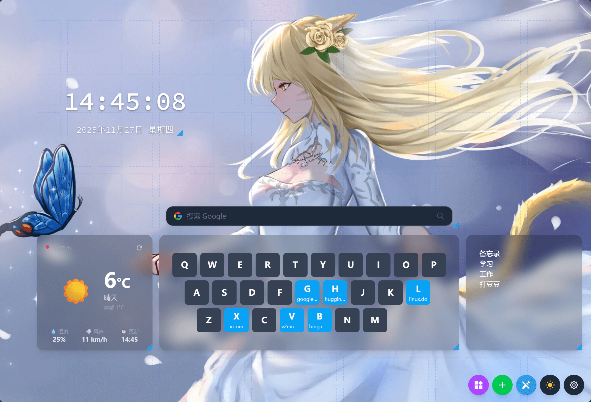

# EchoTab

一个优雅、可定制的浏览器起始页




## 特性

**🎨 高度可定制**
- 深色/浅色主题切换
- 多种背景选择（纯色、渐变、图片、随机壁纸）
- 壁纸智能缓存，加快加载速度
- 灵活的网格布局系统

**📱 实用 Widgets**
- 时钟 - 可自定义字体、颜色、格式
- 天气 - 实时天气信息，支持多城市
- 搜索 - 多引擎快速切换
- 待办事项 - 拖拽排序，完成标记
- 笔记 - Markdown 支持
- SpeedDial - 键盘快捷访问
- 每日一言 - 励志、影视、动漫名言

**🚀 性能优化**
- Widget 按需动态加载
- 离线 PWA 支持
- 数据本地持久化
- 响应式适配各种屏幕

## 快速开始

```bash
# 安装依赖
npm install

# 开发运行
npm run dev

# 生产构建
npm run build
```

## 技术栈

- React 19 + Vite
- TailwindCSS v4
- Zustand 状态管理
- IndexedDB 壁纸缓存

## 许可证

MIT License
